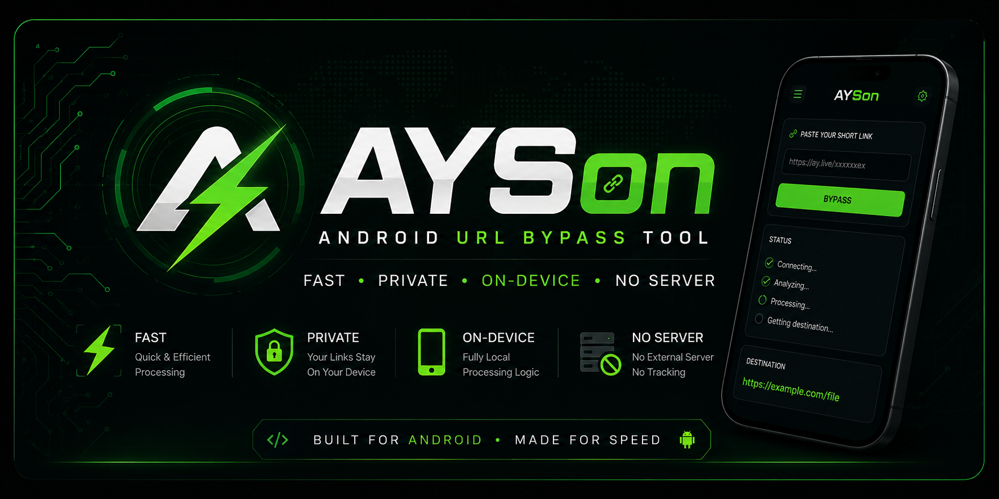

⚡ AYSON

  

  <b>Fast Android URL Bypass Tool</b> 
  Bypass supported short-link services directly on your Android device.

  
  
  
  
  
  

  

---

📖 About

AYSon is an Android application that automates supported short-link flows.

The application performs its processing entirely on the user's device and does not rely on an external backend server.

For supported services, AYSon automatically follows the required steps and returns the resulting destination.

If a flow reaches an intermediate page that requires manual interaction (for example, verification or user input), the application provides that page so the user can continue.

---

✨ Features

- ⚡ Fast processing
- 📱 Android application
- 🔒 Fully on-device logic
- 🚫 No dedicated external server
- ✅ Automatic AY.Live support
- 🔗 Intermediate page detection
- 🎯 Lightweight interface
- 🧩 Easy to use

---

✅ Supported Services

Service| Status
AY.Live| ✅ Fully Supported
Tulink| ⚠ Manual Continuation
Additional Services| 🚧 Planned

---

🚀 How It Works

Short Link
     │
     ▼
Paste into AYSon
     │
     ▼
Automatic Processing
     │
     ├──────────────► Destination Link ✅
     │
     └──────────────► Intermediate Page
                         │
                         ▼
                  Continue Manually

---

📷 Screenshots

screenshots/
 ├── home.png
 ├── processing.png
 ├── intermediate.png
 └── result.png

Add screenshots inside the screenshots folder.

---

📦 Installation

1. Open the Releases page.
2. Download the latest APK.
3. Install the APK.
4. Launch AYSon.
5. Start bypassing supported links.

---

📲 Usage

1. Copy a supported short link.
2. Open AYSon.
3. Paste the link.
4. Tap Start.
5. Wait for processing.
6. Receive the destination or the intermediate page if manual continuation is required.

---

🔒 Privacy

AYSon does not operate its own processing server.

Processing is performed locally on the user's device.

Network requests are only made when interacting with the websites involved in the short-link flow.

No dedicated backend is used to process user links.

---

🛣 Roadmap

Version 1.x

- ✅ AY.Live support
- ✅ Intermediate page detection
- ✅ Fully local processing

Future

- ⏳ More supported services
- ⏳ Better UI
- ⏳ Dark Mode improvements
- ⏳ Automatic update checker
- ⏳ Improved error handling
- ⏳ Performance optimizations

---

📁 Project Structure

ayson-app/
│
├── assets/
│   ├── banner.png
│   ├── logo.png
│   └── demo.gif
│
├── screenshots/
│   ├── home.png
│   ├── processing.png
│   ├── intermediate.png
│   └── result.png
│
├── README.md
├── LICENSE
├── CHANGELOG.md
└── source...

---

🤝 Contributing

Contributions are welcome.

Feel free to:

- Report bugs
- Suggest improvements
- Open Pull Requests
- Share feature ideas

---

⚠ Disclaimer

This software is provided for educational and research purposes.

Users are responsible for ensuring that their use of this software complies with applicable laws and the terms of service of any websites or services they access.

---

📄 License

License information will be added in a future release.

---

❤️ Credits

Developed by the Black Corp.

Special thanks to everyone who contributes by reporting issues, suggesting improvements, and helping the project evolve.

---

⚡ Made for Android

If you like this project, consider giving it a ⭐ on GitHub.

## ⭐ Support

If you find this project useful, consider starring the repository.

Feedback, bug reports and feature requests are always welcome.
